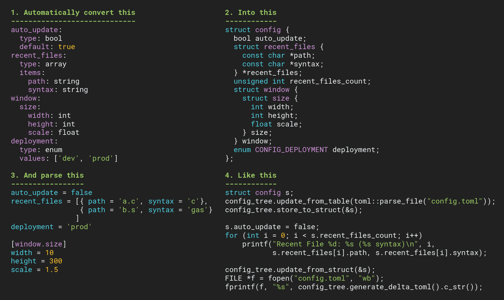

GenConfig
=========
Aims to provide less-painful C/C++ app configuration support.



Motivation
----------
Created because all of the config systems I have used (or created) in the past had too many pain points, like:
- Requiring things to be defined in multiple places
- Not using standard, human-friendly configuration formats
- Lacking validation of basic types and structure
- Not supporting hierarchical data structures, arrays, strings very well
- Requiring tedious structure maintenance
- Requiring accessor calls to get at simple data fields
- Not supporting configuration deltas

This system attempts to alleviate those pain points and make configuration suck less:
- Automatically generates structure definition code from an input specification, which is easy to write
- Loads application configuration from [TOML](https://toml.io/en/) format, which is standardized and human-friendly
- Validates user configuration matches expected structure and fields are of expected type
- Support hierarchical structures of basic types: `bool`, `int`, `float`, `enum`, strings (UTF-8), and arrays
- Minimizes development effort: just define the setting once in a spec file and the rest is handled
- Usable in C/C++, without having to do any lookups or extra validation: just read from a `struct`
- Supports saving configuration deltas

How it Works
------------
- You define the options you want for your app in a spec file
- You run `gen_config.py` to generate a header file with `struct config` definition
- User runs your app, providing their settings in a `.toml` file matching your specification
	- Your code calls a function to load, parse, and store the config file to the `config` structure
	- Your code accesses the config by just reading from and writing to the `config` struct
	- Your code changes `config` structure in response to some user action
	- Your code calls a function to save the config delta to the user's `.toml` config file
- You retain a bit more hair that you might have ripped out using/creating another configuration system
- Your app makes lots of money and you send some my way because you support open-source development. Thanks, that's nice of you.

Requirements
------------
- [toml++](https://marzer.github.io/tomlplusplus/), which is used to parse config file
- Compiler that supports C++17

Example
-------
This is the specification file that defines your config options:

```yaml
company:
  name: string
  headquarters:
    state: string
    city: string

  products:
    type: array
    items:
      name:
        type: string
        default: New Product
      price: float
      inventory: int
      international_shipping:
        type: bool
        default: true
      suppliers:
        type: array
        items: string
      category:
        type: enum
        values: ['fruit', 'vegetable', 'beverage', 'explosive']
```

After running `gen_config.py`, this C code is generated automatically.

```C
enum CONFIG_COMPANY_PRODUCTS_CATEGORY {
	CONFIG_COMPANY_PRODUCTS_CATEGORY_FRUIT,
	CONFIG_COMPANY_PRODUCTS_CATEGORY_VEGETABLE,
	CONFIG_COMPANY_PRODUCTS_CATEGORY_BEVERAGE,
	CONFIG_COMPANY_PRODUCTS_CATEGORY_EXPLOSIVE,
	CONFIG_COMPANY_PRODUCTS_CATEGORY__COUNT
};

struct config {
  struct company {
    const char *name;
    struct headquarters {
      const char *state;
      const char *city;
    } headquarters;
    struct products {
      const char *name;
      float price;
      int inventory;
      bool international_shipping;
      const char **suppliers;
      unsigned int suppliers_count;
      enum CONFIG_COMPANY_PRODUCTS_CATEGORY category;
    } *products;
    unsigned int products_count;
  } company;
};
```

<details>
<summary>
Additionally, a corresponding `CNode` tree is created, that's used to support everything:
</summary>

```cpp
CNode config_tree =
 ctab("config", {
  ctab("company", {
   cstring(
    offsetof(struct config, company.name),
    "name", ""),
   ctab("headquarters", {
    cstring(
     offsetof(struct config, company.headquarters.state),
     "state", ""),
    cstring(
     offsetof(struct config, company.headquarters.city),
     "city", "")
   }),
   carray(
    offsetof(struct config, company.products),
    offsetof(struct config, company.products_count),
    sizeof(struct config::company::products),
    "products",
    ctab("", {
     cstring(
      offsetof(struct config::company::products, name),
      "name", "New Product"),
     cnumber(
      offsetof(struct config::company::products, price),
      "price", 0.0),
     cinteger(
      offsetof(struct config::company::products, inventory),
      "inventory", 0),
     cbool(
      offsetof(struct config::company::products, international_shipping),
      "international_shipping", true),
     carray(
      offsetof(struct config::company::products, suppliers),
      offsetof(struct config::company::products, suppliers_count),
      sizeof(((struct config::company::products *){0})->suppliers[0]),
      "suppliers",
      cstring(
       0, "", "")
     ),
     cenum(
      offsetof(struct config::company::products, category),
      "category", {"fruit", "vegetable", "beverage", "explosive"}, "fruit")
    })
   )
  })
 });
```

</details>

Config file to be loaded at runtime, in [TOML](https://toml.io/en/) format:

```toml
[company]
	name = 'Acme Corp'
	products = [
		{ name = 'Apple', price = 1.2, inventory = 100, suppliers = ['Midwest Orchard', 'Tasty Apples Inc.'], category = 'fruit' },
		{ name = 'TNT', price = 50, inventory = 1000, category = 'explosive', international_shipping = false },
		]

[company.headquarters]
	city = 'Phoenix'
	state = 'Arizona'
```

Loading the config basically looks like:

```cpp
#include <toml.hpp> // Required for basic parsing
#include <cnode.h> // Required data structure for config mgmt

#define DEFINE_CONFIG_TREE
#include "config.h"

// Load config from user file
struct config s;
auto toml_table = toml::parse_file("config.toml");
config_tree.update_from_table(toml_table);
config_tree.store_to_struct(&s);
```

Then when you are ready to save the config again:

```cpp
// Update config tree from structure if you have modified it
config_tree.update_from_struct(&s);

// Save config
FILE *f = fopen("config.toml", "wb");
fprintf(f, "%s", config_tree.generate_delta_toml().c_str());
```
